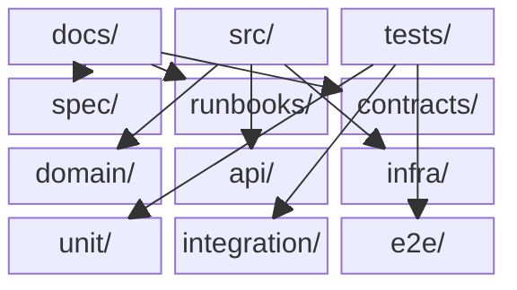
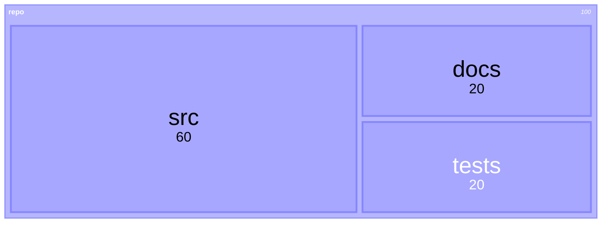
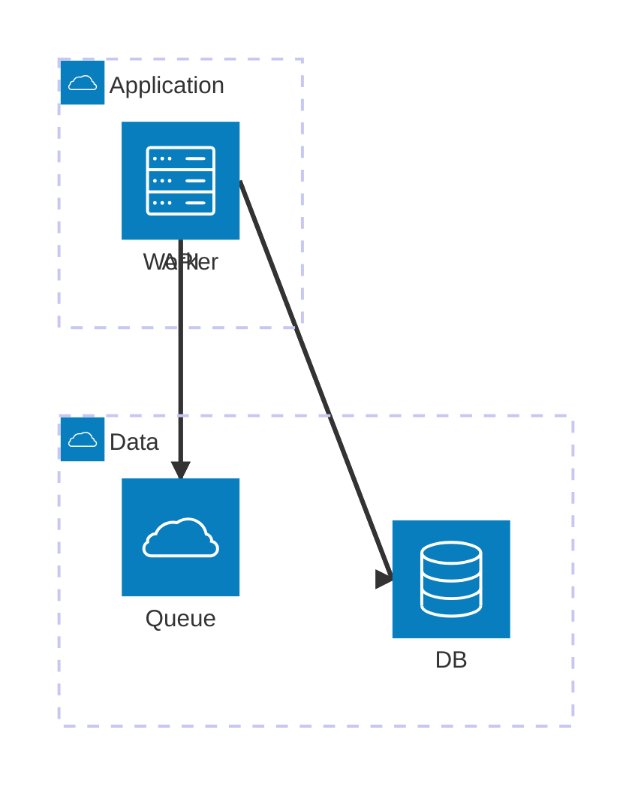

# File Structure Patterns for Specifications

Reference guide for understanding and documenting codebase file structures during specification creation.

## Contents

- [Purpose](#purpose)
- [Common Project Structures](#common-project-structures)
- [How to Document File Structure](#how-to-document-file-structure)
- [Patterns for Spec Sections](#patterns-for-spec-sections)
- [Traceability Mapping](#traceability-mapping)

---

## Purpose

When writing specifications, understanding the codebase structure helps:

1. **Locate existing contracts**: Find where APIs, schemas, and types are defined
2. **Plan new files**: Know where new code should go
3. **Create traceability**: Map spec IDs to actual file paths
4. **Avoid duplication**: Discover existing implementations

---

## Common Project Structures

### Visual (block diagram)



### Visual (treemap; useful for showing module “weight”)



### Monorepo (Turborepo/Nx)

```
project/
├── apps/
│   ├── web/                    # Frontend application
│   │   ├── src/
│   │   │   ├── pages/          # Routes (Next.js)
│   │   │   ├── components/     # UI components
│   │   │   └── lib/            # Shared utilities
│   │   └── package.json
│   └── api/                    # Backend service
│       ├── src/
│       │   ├── routes/         # API endpoints
│       │   ├── services/       # Business logic
│       │   └── db/             # Database access
│       └── package.json
├── packages/
│   ├── shared/                 # Shared types, utilities
│   │   └── src/
│   ├── ui/                     # Shared components
│   │   └── src/
│   └── config/                 # Shared configs
├── docs/
│   └── spec/                   # Specifications (target)
└── turbo.json
```

**Spec location**: `docs/spec/`
**Contract locations**: `packages/shared/src/types/`, `apps/api/src/routes/`

### Python Backend (FastAPI/Django)

```
project/
├── src/
│   ├── api/
│   │   ├── routes/             # Endpoint definitions
│   │   ├── schemas/            # Pydantic models (contracts)
│   │   └── dependencies/       # DI, auth
│   ├── core/
│   │   ├── config.py           # Settings
│   │   └── security.py         # Auth logic
│   ├── services/               # Business logic
│   ├── models/                 # ORM models
│   └── repositories/           # Data access
├── tests/
│   ├── unit/
│   ├── integration/
│   └── e2e/
├── docs/
│   └── spec/
└── pyproject.toml
```

**Spec location**: `docs/spec/`
**Contract locations**: `src/api/schemas/`, `src/models/`

### Go Service

```
project/
├── cmd/
│   └── server/
│       └── main.go             # Entry point
├── internal/
│   ├── api/
│   │   ├── handlers/           # HTTP handlers
│   │   └── middleware/
│   ├── domain/
│   │   ├── models/             # Domain entities
│   │   └── services/           # Business logic
│   └── infra/
│       ├── db/                 # Database
│       └── http/               # HTTP client
├── pkg/                        # Public packages
├── api/
│   └── openapi.yaml            # API spec
├── docs/
│   └── spec/
└── go.mod
```

**Spec location**: `docs/spec/` or `api/`
**Contract locations**: `api/openapi.yaml`, `internal/domain/models/`

### Frontend (React/Vue)

```
project/
├── src/
│   ├── app/                    # App shell, routing
│   ├── pages/                  # Page components
│   ├── features/               # Feature modules
│   │   └── auth/
│   │       ├── components/
│   │       ├── hooks/
│   │       ├── api/            # API calls
│   │       └── types.ts        # Feature types
│   ├── components/             # Shared components
│   ├── lib/                    # Utilities
│   └── types/                  # Global types
├── tests/
│   ├── unit/
│   └── e2e/
└── docs/
    └── spec/
```

**Spec location**: `docs/spec/`
**Contract locations**: `src/types/`, `src/features/*/types.ts`

---

## How to Document File Structure

### Architecture view (when structure follows deployment)




### In Spec: System Context Section

Include a simplified structure showing spec-relevant files:

```markdown
## 3. System Context

### Codebase Structure (relevant files)

\`\`\`
src/
├── api/
│   └── auth/                   ← SPEC-AUTH-* implementation
│       ├── login.ts            ← SPEC-AUTH-001
│       ├── session.ts          ← SPEC-AUTH-002, SPEC-AUTH-003
│       └── types.ts            ← API contracts
├── services/
│   └── auth.service.ts         ← Business logic
└── db/
    └── user.repository.ts      ← Data access
\`\`\`
```

### In Spec: Contracts Section

Link to actual files:

```markdown
## 6. Contracts

### 6.1 API Contracts

| Endpoint | Handler | Request Schema | Response Schema |
|----------|---------|---------------|-----------------|
| POST /login | [auth/login.ts#L15](../src/api/auth/login.ts#L15) | [LoginRequest](../src/api/auth/types.ts#L5) | [LoginResponse](../src/api/auth/types.ts#L12) |
```

---

## Patterns for Spec Sections

### State Machines

When documenting state machines, locate:

```
Look for:
├── state-machines/             # XState definitions
├── reducers/                   # Redux reducers (implicit state)
├── stores/                     # Zustand/Pinia stores
└── domain/models/              # Entities with state
```

### Error Models

Error contracts are typically in:

```
Look for:
├── errors/                     # Custom error classes
├── exceptions/                 # Exception definitions
├── api/errors.ts               # API error responses
└── middleware/error-handler.ts # Error handling
```

### Events

Event definitions for event-driven systems:

```
Look for:
├── events/                     # Event definitions
├── messages/                   # Message schemas
├── pubsub/                     # Pub/sub handlers
└── domain/events/              # Domain events
```

---

## Traceability Mapping

### Format in Spec

```markdown
## 12. Traceability

| Spec ID | File | Line | Test |
|---------|------|------|------|
| SPEC-AUTH-001 | src/api/auth/login.ts | L15-L45 | tests/auth/login.test.ts |
| SPEC-AUTH-002 | src/services/session.ts | L10-L30 | tests/session.test.ts |
```

### Automated Traceability

Add comments in code:

```typescript
// SPEC-AUTH-001: User login with email/password
export async function login(req: LoginRequest): Promise<LoginResponse> {
  // Implementation...
}
```

Then grep to verify coverage:

```bash
# Find all SPEC references in code
grep -r "SPEC-AUTH-" src/

# Find specs without implementation
diff <(grep -h "SPEC-AUTH-" docs/spec/*.md | sort -u) \
     <(grep -rh "SPEC-AUTH-" src/ | sort -u)
```

---

## Discovery Commands

When analyzing a new codebase:

```bash
# Find all TypeScript types/interfaces
find . -name "*.ts" -exec grep -l "interface\|type " {} \;

# Find all Python schemas (Pydantic)
find . -name "*.py" -exec grep -l "BaseModel\|Schema" {} \;

# Find all API routes
grep -r "app\.\(get\|post\|put\|delete\)" --include="*.py"
grep -r "router\.\(get\|post\|put\|delete\)" --include="*.ts"

# Find all state machines
find . -name "*.ts" -exec grep -l "createMachine\|stateDiagram" {} \;

# Find existing specs
find . -name "*.md" -path "*/spec/*"
```

---

## Integration with spec-recon

When running `spec-recon`, gather:

1. **Project structure**: Root layout, key directories
2. **Contract locations**: Types, schemas, OpenAPI
3. **Test locations**: Where BDD scenarios should go
4. **Existing specs**: What's already documented

Output should inform `spec-specification` where to place links and traceability.
