# Mermaid Catalog (all diagram types used by this spec system)

This catalog is intentionally “copy/paste first”: every example uses ASCII IDs and quoted labels to reduce renderer breakage.

> Note: Some diagram types are marked as experimental/beta in Mermaid docs (e.g., `architecture-beta`, `radar-beta`, `treemap-beta`). Ensure your renderer supports Mermaid v11+ if you use them.

## Flowchart

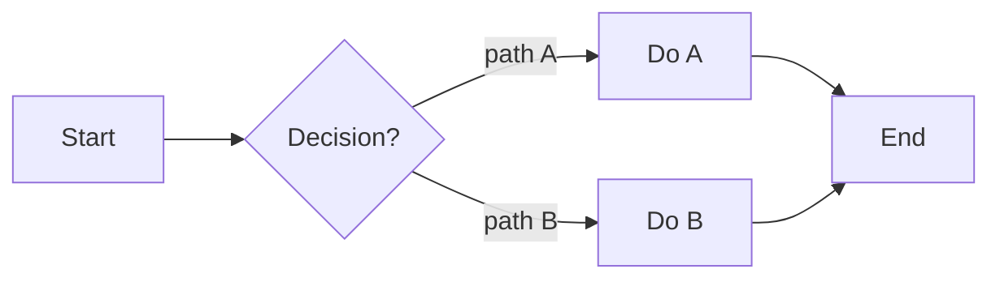

## Sequence

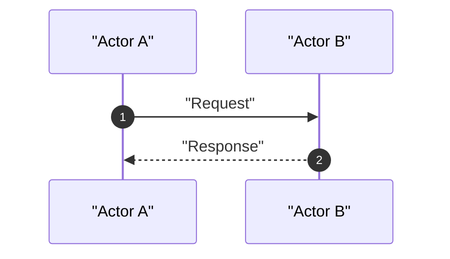

## Class

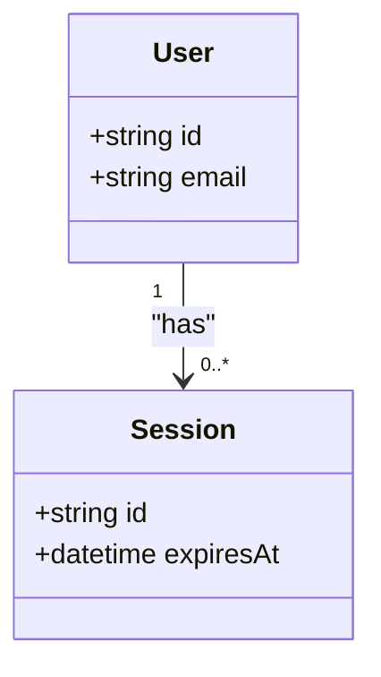

## State machine

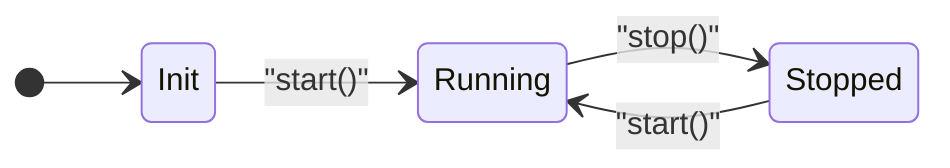

## ER

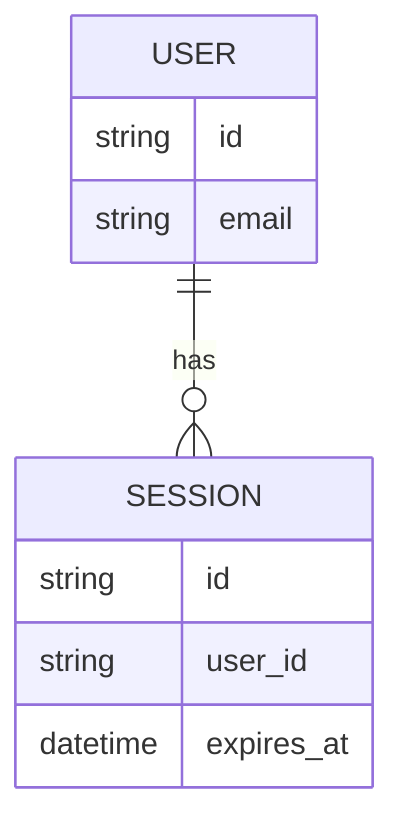

## User Journey

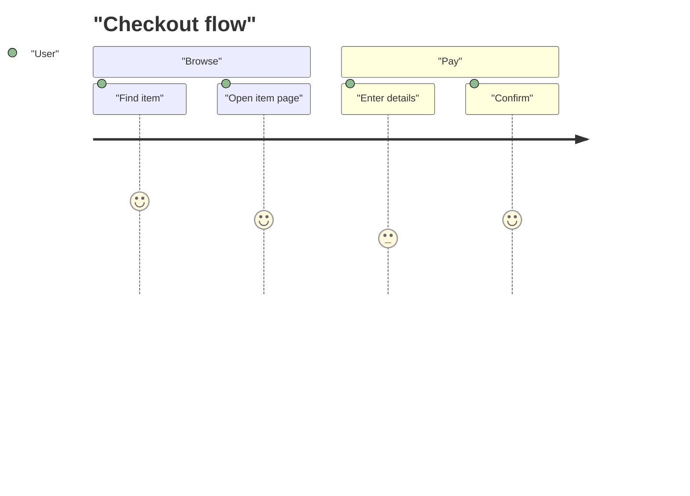

## Gantt

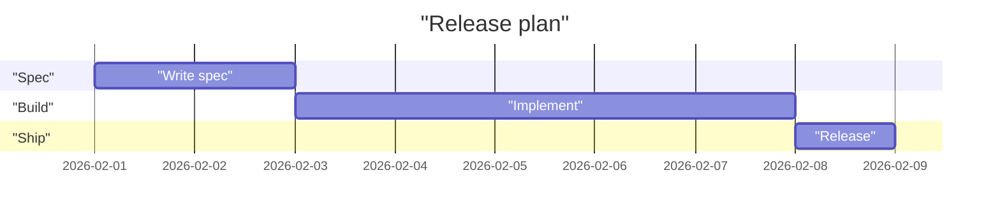

## Pie

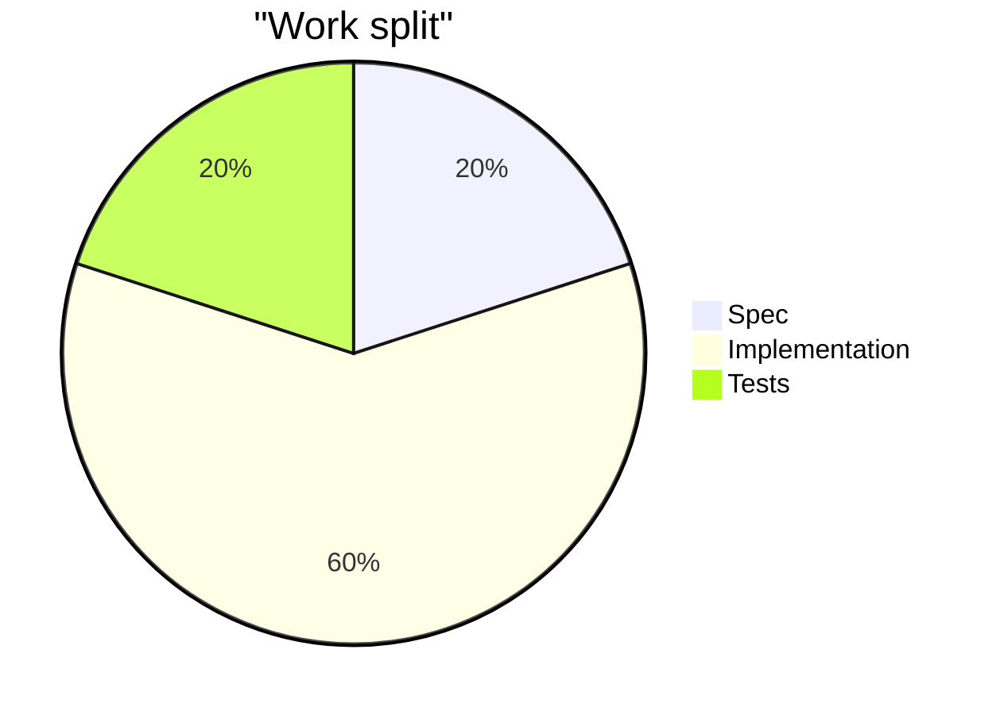

## Quadrant chart

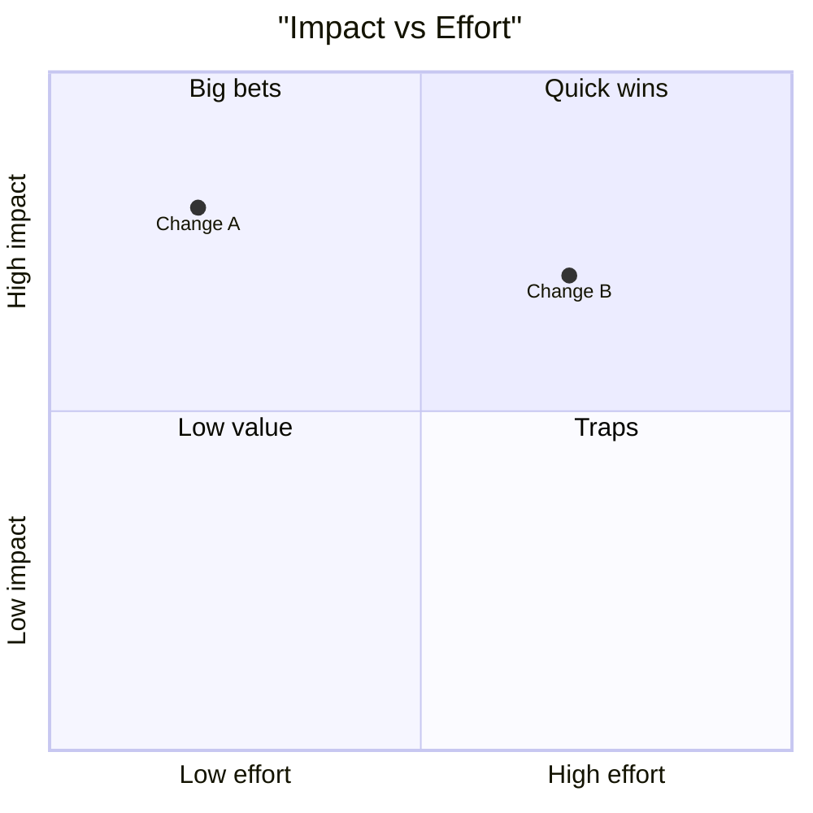

## Requirement diagram

```mermaid
requirementDiagram
  requirement REQ_001 {
    id: "SPEC-EXAMPLE-001"
    text: "System shall accept requests with valid payload."
    risk: "medium"
    verifymethod: "test"
  }

  requirement REQ_002 {
    id: "SPEC-EXAMPLE-002"
    text: "System shall reject invalid payloads with a structured error."
    risk: "high"
    verifymethod: "test"
  }

  REQ_001 - refines -> REQ_002
```

## GitGraph

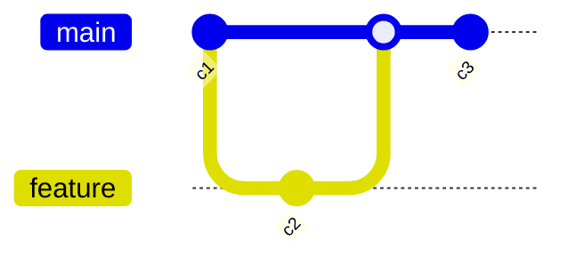

## C4 (all supported entrypoints)

> C4 support in Mermaid is marked experimental and is PlantUML-compatible. Keep diagrams minimal and version-check your renderer.

### C4Context

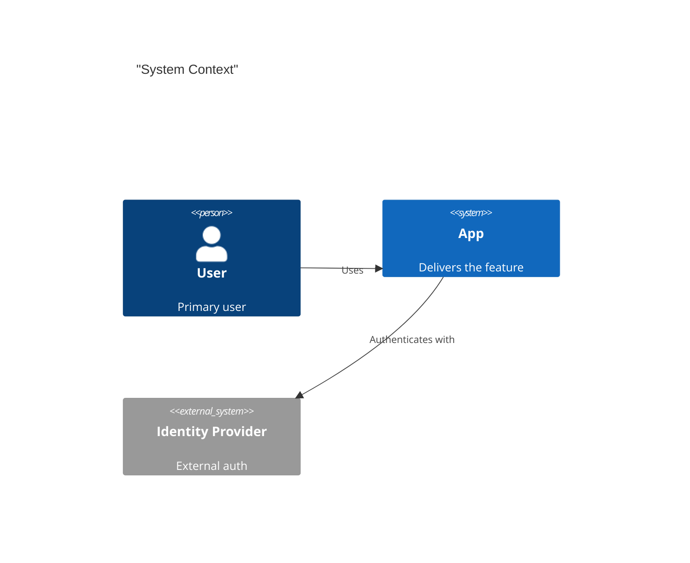

### C4Container

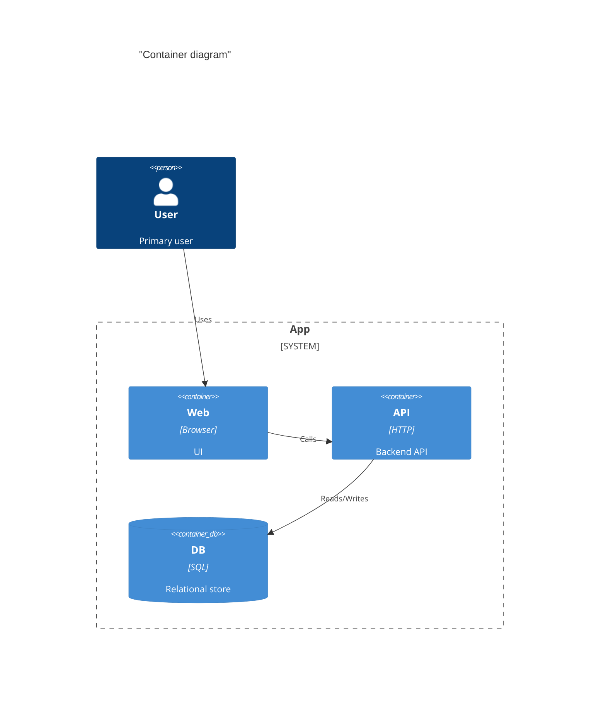

### C4Component

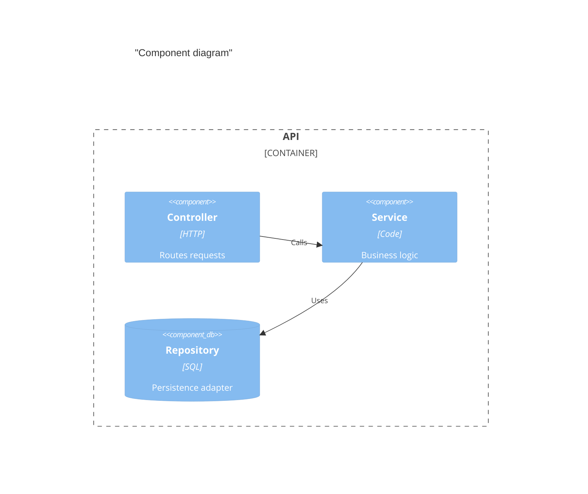

### C4Dynamic

```mermaid
C4Dynamic
  title "Dynamic diagram"
  RelIndex(1, user, web, "Submit request")
  RelIndex(2, web, api, "POST /v1/items")
  RelIndex(3, api, db, "INSERT item")
  RelIndex(4, api, web, "201 Created")
```

### C4Deployment

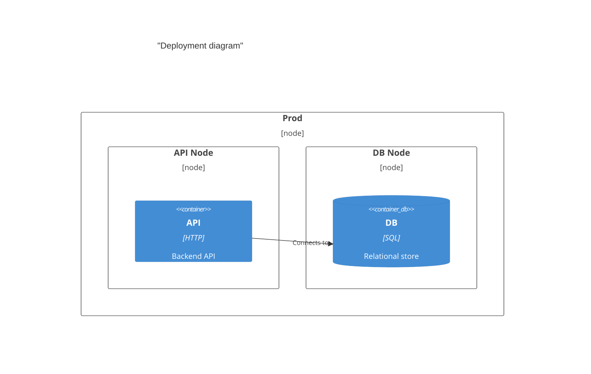


## Mindmap

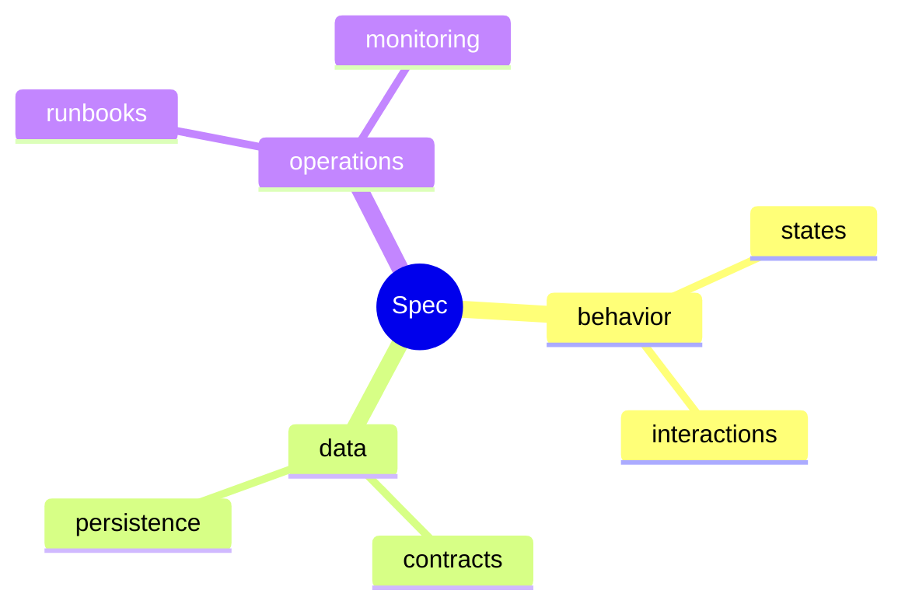

## Timeline

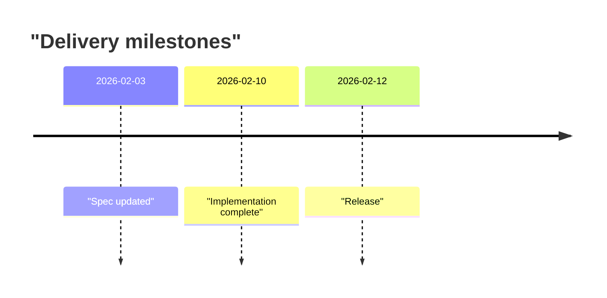

## ZenUML (sequence-style)

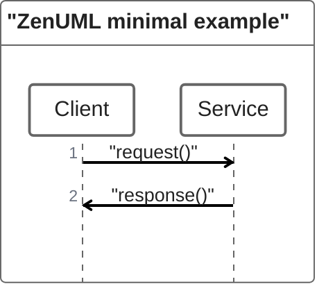

## Sankey

```mermaid
sankey
  "Ingress","Service",80
  "Ingress","Reject",20
  "Service","DB",60
  "Service","Cache",20
```

## XY Chart

```mermaid
xychart
  title "Requests per minute"
  x-axis "t" ["t1", "t2", "t3", "t4"]
  y-axis "rpm" 0 --> 100
  line [10, 30, 80, 60]
  bar [5, 20, 40, 30]
```


## Block diagram

```mermaid
block
  columns 2
  A["A"] B["B"]
  A --> B
```

## Packet

```mermaid
packet
  0-3: "Version"
  4-7: "IHL"
  8-15: "DSCP/ECN"
  16-31: "Total Length"
```

## Kanban

```mermaid
kanban
  todo[Todo]
    t1[Write spec]@{ assigned: "dev" }
  doing[In progress]
    t2[Implement]@{ assigned: "dev" }
  done[Done]
    t3[Ship]@{ assigned: "release" }
```


## Architecture

```mermaid
architecture-beta
  group app(cloud)[Application]
  service api(server)[API] in app
  service worker(server)[Worker] in app

  group data(cloud)[Data]
  service db(database)[DB] in data
  service mq(cloud)[Queue] in data

  api:R --> L:db
  api:B --> T:mq
  worker:B --> T:mq
  worker:R --> L:db
```


## Radar

```mermaid
radar-beta
  title "Quality profile"
  axis a["Correctness"], b["Maintainability"], c["Observability"], d["Performance"], e["Security"]
  curve v1["v1"]{60, 70, 40, 50, 65}
  curve v2["v2"]{75, 80, 65, 60, 78}
```

## Treemap

```mermaid
treemap-beta
  "system"
    "features": 50
    "contracts": 20
    "runbooks": 10
    "testing": 20
```
