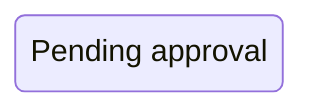
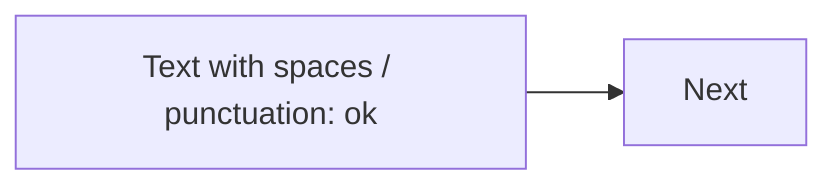

# Mermaid Safety / Escaping Guide

Goal: make diagrams render reliably across different Mermaid integrations (Obsidian, mermaid.live, CI rendering, etc.).

## 1) IDs vs labels

Treat IDs as “machine-safe” and labels as “human-safe”.

- IDs: ASCII only, no spaces, no punctuation. Prefer `A_B_C`, `ST_PENDING`, `REQ_001`.
- Labels: always quoted if they contain spaces/punctuation.

Examples:

## 2) Quote anything that might be misread

For many diagrams, Mermaid accepts unquoted text, but quoting is a cheap way to avoid surprises.

- Good: `title "My title with spaces"`
- Good: `participant API as "API Gateway"`
- Good: `A["Node label"]`

## 3) Avoid reserved words as IDs

Some tokens (e.g., `end`) can terminate blocks in certain syntaxes.

Mitigation:
- Never use those tokens as raw IDs.
- If you must show them, keep them inside a quoted label.

## 4) Keep diagrams small and composable

- 1 diagram per concern.
- Link to dedicated diagrams (e.g., state machines under `docs/spec/system/state-machines/`) instead of inflating a feature node.

## 5) Version awareness

Some diagram types are newer / experimental (e.g., `architecture-beta`, `radar-beta`, `treemap-beta`).
If a renderer doesn’t support them, prefer classic diagrams (`flowchart`, `sequenceDiagram`, `classDiagram`, `stateDiagram-v2`, `erDiagram`).

## 6) C4 is experimental

Mermaid marks C4 diagrams as experimental. If your integration can’t render them, fall back to `flowchart` + `sequenceDiagram`.
