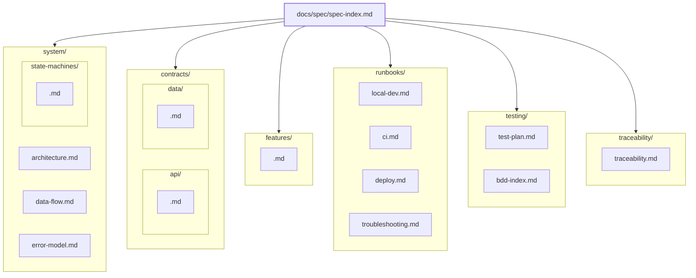
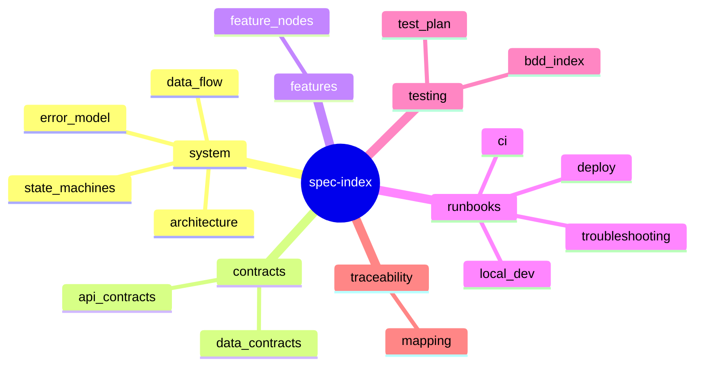

# Spec Graph Structure (Obsidian-friendly)

This workspace uses **small spec nodes linked together** instead of one giant spec file.

## Root

- `docs/spec/spec-index.md` is the entry point.
- Every spec node must link back to `[[spec-index]]`.

## Node categories

```
docs/spec/
  spec-index.md
  glossary.md

  system/
    architecture.md
    data-flow.md
    error-model.md
    state-machines/
      <machine>.md

  contracts/
    api/
      <service>.md
    data/
      <entity>.md

  features/
    <feature>.md

  runbooks/
    local-dev.md
    ci.md
    deploy.md
    troubleshooting.md

  testing/
    test-plan.md
    bdd-index.md

  traceability/
    traceability.md
```

## Rules

1) **One change = one node**. If the node grows, split into smaller nodes and link them.
2) **Links first**. The `Links:` block at the top is mandatory.
3) `SPEC-<AREA>-NNN` IDs are stable once published.
4) Keep operational how-to in `runbooks/` and behavior intent in `features/`.

## Why this works

- Specs become navigable and composable.
- Obsidian graph becomes a real map, not a hairball.
- Each agent/skill can “own” one node type without stepping on others.


## Visual map (Mermaid)

### High-level folder topology



### Concept map (what links to what)


