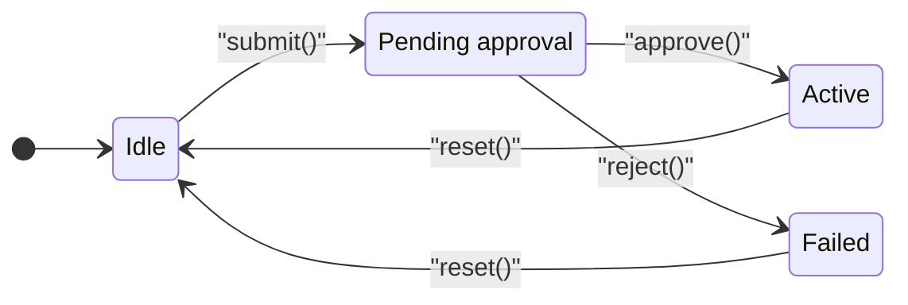
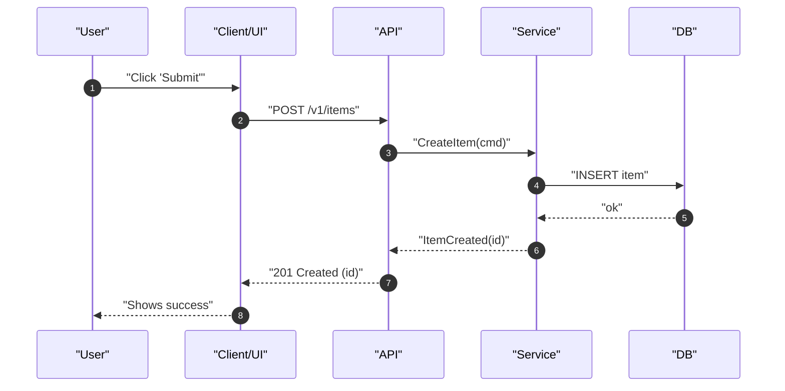
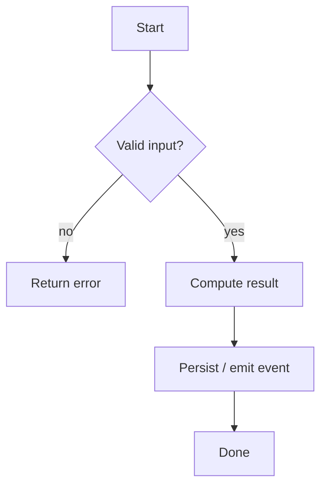
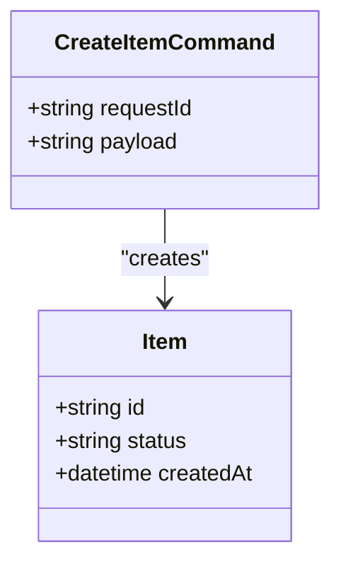
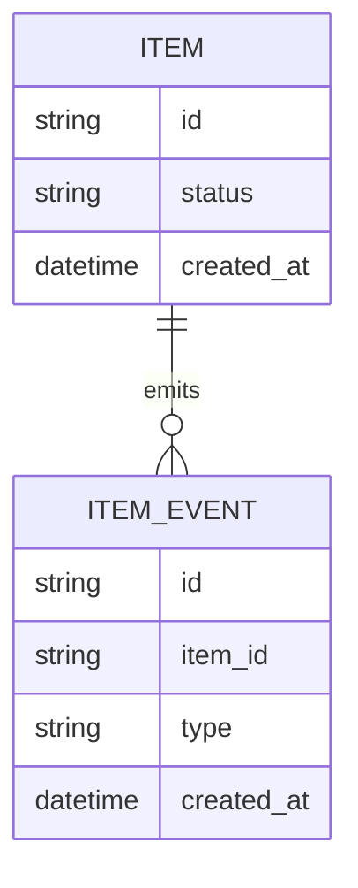

# Spec Node Template

Use this as a starting point for any node in `docs/spec/**`.

```md
# <Title>

Links:
- [[spec-index]]
- [[runbooks/local-dev]]
- [[testing/test-plan]]

Spec Namespace: SPEC-<AREA>
Status: Draft | Proposed | Accepted | Deprecated
Version: 1.0
Owners:
Last Updated: YYYY-MM-DD

## Overview

## User-visible behavior

## Inputs / Outputs

## Diagrams (Mermaid)

### State machine (REQUIRED per change)


### Sequence diagram (recommended for cross-component behavior)


### Flowchart (activity-style branching / algorithm)


### Class diagram (types / domain model)


### ER diagram (persistence model)


### Requirement diagram (traceability for SPEC/AC IDs)
```mermaid
requirementDiagram
  requirement SPEC_AREA_001 {
    id: "SPEC-<AREA>-001"
    text: "System shall validate inputs before processing."
    risk: "medium"
    verifymethod: "test"
  }

  requirement SPEC_AREA_002 {
    id: "SPEC-<AREA>-002"
    text: "System shall persist a durable record for each accepted request."
    risk: "high"
    verifymethod: "test"
  }

  SPEC_AREA_001 - derives -> SPEC_AREA_002
```
### ID conventions

- Requirements: `SPEC-<AREA>-NNN`
- Acceptance criteria inside a node: `AC-1`, `AC-2`, ...
- Scenario IDs (when BDD exists): `SC-1`, `SC-2`, ...

### Splitting

If a node grows too large:
- move contracts to `docs/spec/contracts/...`
- move run commands to `docs/spec/runbooks/...`
- link them from `Links:`
