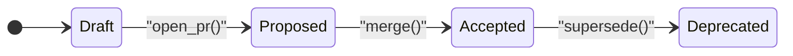
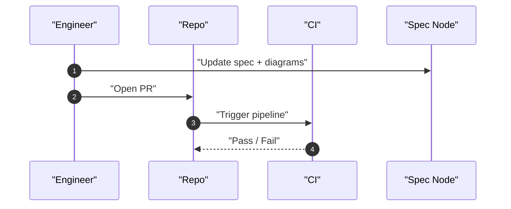

# Specification Writing Tutorials

Step-by-step guides for creating contract-grade specifications with stable IDs and traceability.

## Contents

- [Tutorial 1: Your First Specification](#tutorial-1-your-first-specification)
- [Tutorial 2: State Machines](#tutorial-2-state-machines)
- [Tutorial 3: API Contracts](#tutorial-3-api-contracts)
- [Tutorial 4: Error Models](#tutorial-4-error-models)
- [Tutorial 5: Acceptance Criteria](#tutorial-5-acceptance-criteria)

---

## Tutorial 1: Your First Specification

### Step 1: Create the spec file

```bash
mkdir -p docs/spec
touch docs/spec/auth.md
```

### Step 2: Add YAML frontmatter (optional but recommended)

```markdown
---
spec_namespace: SPEC-AUTH
version: 0.1
status: Draft
owners: [team-auth]
last_updated: 2025-01-16
---
```

### Step 3: Write the overview

```markdown
# Authentication System Specification

- Spec Namespace: SPEC-AUTH
- Version: 0.1
- Status: Draft

## 1. Overview

### Problem Statement
Users need secure access to the application with session management.

### Goals
- Secure authentication via email/password
- Session management with refresh tokens
- Rate limiting for brute force protection

### Non-goals
- Social login (OAuth) - future scope
- 2FA - handled by separate spec

### In-scope
- Login, logout, session refresh
- Password reset flow

### Out-of-scope
- User registration (see SPEC-REGISTRATION)
```

### Step 4: Add glossary

```markdown
## 2. Glossary

| Term | Definition |
|------|-----------|
| Access Token | Short-lived JWT (15 min) for API access |
| Refresh Token | Long-lived token (7 days) to obtain new access tokens |
| Session | User's authenticated state, tracked by refresh token |
```

### Step 5: Continue with remaining sections

Follow the canonical outline in SKILL.md for sections 3-13.

---

## Tutorial 2: State Machines

### Mermaid state machine baseline (copy/paste)

Use `stateDiagram-v2` and **alias** user-facing labels to ASCII IDs.



### When to add a sequence diagram

If the behavior involves multiple actors/components, add a `sequenceDiagram` right in the spec node:




### When to Use

Add state machines when behavior is **stateful**:
- Order lifecycle (created → paid → shipped → delivered)
- Document workflow (draft → review → approved → published)
- Connection states (disconnected → connecting → connected → error)

### Step 1: Identify states and events

```
States: Idle, Authenticating, Authenticated, Expired
Events: login(), success, failure, logout(), tokenExpired, refresh()
```

### Step 2: Draw the diagram

```markdown
## 4. State Model

### 4.1 Authentication State Machine

#### Purpose
Tracks user authentication state within a session.

#### Mermaid Diagram

\`\`\`mermaid
stateDiagram-v2
    [*] --> Idle
    Idle --> Authenticating: login()
    Authenticating --> Authenticated: success
    Authenticating --> Idle: failure
    Authenticated --> Idle: logout()
    Authenticated --> Expired: tokenExpired
    Expired --> Authenticated: refresh()
    Expired --> Idle: refreshFailed
\`\`\`
```

### Step 3: Define each state

```markdown
#### States

| State | Description | Invariants |
|-------|-------------|-----------|
| Idle | No active session | No tokens stored |
| Authenticating | Login in progress | Request pending |
| Authenticated | Valid session | Access token valid |
| Expired | Access token expired | Refresh token may be valid |
```

### Step 4: Define events

```markdown
#### Events

| Event | Trigger | Payload | Side Effects |
|-------|---------|---------|--------------|
| login() | User submits credentials | { email, password } | API call |
| success | API returns tokens | { accessToken, refreshToken } | Store tokens |
| failure | API returns error | { error } | Clear state |
| logout() | User clicks logout | none | Clear tokens, API call |
```

### Step 5: Document edge cases

```markdown
#### Edge Cases

- **Concurrent logins**: Second login cancels first (Authenticating → Idle → Authenticating)
- **Offline refresh**: Queue refresh, retry when online
- **Invalid refresh token**: Force logout (Expired → Idle)
```

---

## Tutorial 3: API Contracts

### Step 1: Define the endpoint

```markdown
## 6. Contracts

### 6.1 API Contracts

#### POST /api/v1/auth/login

**SPEC-AUTH-001**: User login with email and password

**Request**:
\`\`\`typescript
interface LoginRequest {
  email: string;     // Valid email format
  password: string;  // Min 8 chars
}
\`\`\`

**Response (200)**:
\`\`\`typescript
interface LoginResponse {
  accessToken: string;   // JWT, expires in 15 min
  refreshToken: string;  // Opaque token, expires in 7 days
  expiresIn: number;     // Seconds until access token expires
}
\`\`\`

**Errors**:
| Status | Code | Description |
|--------|------|-------------|
| 400 | INVALID_CREDENTIALS | Email or password incorrect |
| 429 | RATE_LIMITED | Too many attempts |
| 500 | INTERNAL_ERROR | Server error |
```

### Step 2: Add validation rules

```markdown
**Validation**:
- `email`: Must be valid email format (RFC 5322)
- `password`: Min 8 chars, max 128 chars

**Rate Limiting**:
- 5 attempts per email per 15 minutes
- 100 attempts per IP per hour
```

### Step 3: Link to implementation

```markdown
**Implementation**: [src/api/auth/login.ts#L15](../src/api/auth/login.ts#L15)
```

---

## Tutorial 4: Error Models

### Step 1: Define error taxonomy

```markdown
### 6.3 Error Model

#### Error Response Format

\`\`\`typescript
interface ErrorResponse {
  error: {
    code: string;      // Machine-readable code
    message: string;   // Human-readable message
    details?: any;     // Optional additional context
    requestId: string; // For tracing
  };
}
\`\`\`

#### Error Categories

| Category | HTTP Status | Retry | Description |
|----------|-------------|-------|-------------|
| Validation | 400 | No | Invalid input |
| Authentication | 401 | No | Not authenticated |
| Authorization | 403 | No | Not permitted |
| NotFound | 404 | No | Resource not found |
| RateLimit | 429 | Yes (backoff) | Too many requests |
| Internal | 500 | Yes (exponential) | Server error |
```

### Step 2: Define specific error codes

```markdown
#### Auth Error Codes

| Code | Category | Message Template |
|------|----------|-----------------|
| AUTH_INVALID_CREDENTIALS | 400 | Invalid email or password |
| AUTH_SESSION_EXPIRED | 401 | Session expired, please login again |
| AUTH_RATE_LIMITED | 429 | Too many attempts, try again in {seconds} seconds |
| AUTH_TOKEN_INVALID | 401 | Invalid or malformed token |
```

### Step 3: Define retry policy

```markdown
#### Retry Policy

**Retryable errors** (5xx, 429):
- Initial delay: 1s
- Max delay: 30s
- Max attempts: 3
- Backoff: exponential with jitter

**Non-retryable errors** (4xx except 429):
- Fail immediately
- Surface to user
```

---

## Tutorial 5: Acceptance Criteria

### Step 1: Derive from requirements

For each SPEC-* requirement, create AC-* criteria:

```markdown
## 11. Acceptance Criteria

| AC ID | Description | SPEC Refs | SC Placeholders |
|-------|-------------|-----------|-----------------|
| AC-1 | User can login with valid credentials | SPEC-AUTH-001 | SC-1, SC-2 |
| AC-2 | Login fails with invalid password | SPEC-AUTH-001 | SC-3 |
| AC-3 | Session refreshes before expiry | SPEC-AUTH-002 | SC-4, SC-5 |
| AC-4 | Rate limiting blocks after 5 attempts | SPEC-AUTH-003 | SC-6 |
```

### Step 2: Write detailed criteria

```markdown
### AC-1: User can login with valid credentials

**Given**: User has registered account
**When**: User submits correct email and password
**Then**:
- Response is 200 OK
- Response contains valid accessToken (JWT)
- Response contains refreshToken
- Session is created in database

**SPEC Refs**: SPEC-AUTH-001
**Planned Scenarios**: SC-1 (happy path), SC-2 (concurrent login)
```

### Step 3: Create SC placeholders for BDD

```markdown
**Scenario Mapping**:

| SC ID | AC ID | Scenario Description |
|-------|-------|---------------------|
| SC-1 | AC-1 | Successful login returns tokens |
| SC-2 | AC-1 | Concurrent login invalidates previous session |
| SC-3 | AC-2 | Login with wrong password returns 400 |
| SC-4 | AC-3 | Access token refreshes automatically |
| SC-5 | AC-3 | Expired refresh token forces logout |
| SC-6 | AC-4 | 6th login attempt returns 429 |
```

---

## Quick Reference: Spec Writing Checklist

Before marking spec as "Proposed":

- [ ] All sections from canonical outline present
- [ ] Every behavior has SPEC-* ID
- [ ] State machines for stateful behavior
- [ ] Contracts with request/response schemas
- [ ] Error model with codes and retry policy
- [ ] Acceptance criteria with AC-* IDs
- [ ] SC-* placeholders for BDD
- [ ] Traceability mapping started
- [ ] Internal links working
- [ ] External links verified (official docs)


---

## Tutorial 6: Diagram Hygiene (Mermaid)

### Rule of thumb: IDs are for machines, labels are for humans

- Keep IDs ASCII and stable: `ST_PENDING`, `COMP_WORKER`, `REQ_AUTH_001`.
- Put everything “human” inside quotes: `"Pending approval"`, `"POST /v1/items"`.

### Prefer small, scoped diagrams

- 1 diagram per concern (state, interaction, data).
- If it grows past one screen, split into multiple diagrams and link them.

### Use the catalog for lesser-used diagram types

When you need something more specialized (e.g., `sankey`, `xychart`, `kanban`, `packet`, `radar-beta`, `treemap-beta`), copy from:
- `references/mermaid_catalog.md`
