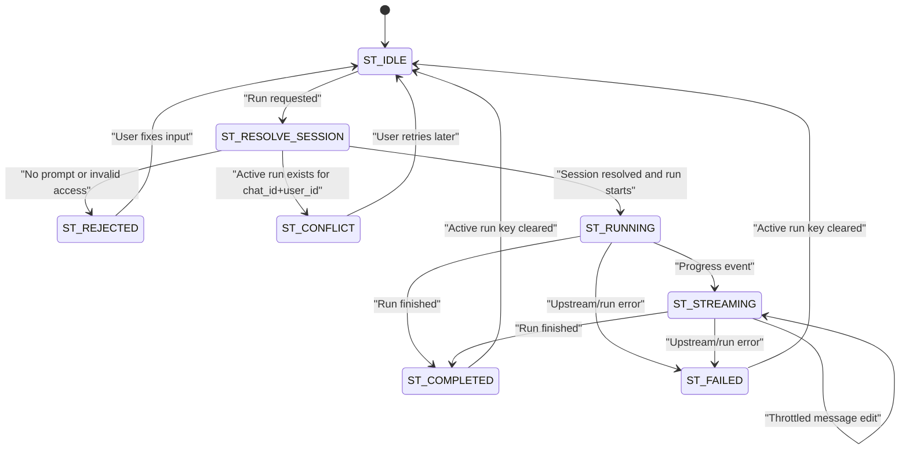

# Telegram UX Session/Run Isolation

Links:
- [[spec-index]]
- [Spec index](../spec-index.md)
- [Telegram Command Specification](telegram-commands.md)

Spec Namespace: SPEC-TGUX
Status: Draft
Version: 0.1
Owners: Maintainers
Last Updated: 2026-02-09

## Overview

This node specifies user-facing Telegram behavior for `/run` execution, user-scoped session selection, and active-run isolation. The intent is to prevent cross-user run collisions in shared chats, while preserving a predictable command experience and compatibility with existing command surfaces.

## User-visible behavior

- `SPEC-TGUX-001`: `/run <prompt>` executes against the caller's effective session, resolved in this order: (1) explicitly selected session for that user, (2) deterministic user-scoped fallback session, (3) command-level usage/help if prompt is missing.
- `SPEC-TGUX-002`: Active run ownership is isolated by `(chat_id, user_id)`. A caller can have at most one in-flight run per chat at a time.
- `SPEC-TGUX-003`: If a second `/run` is attempted while a run is active for the same `(chat_id, user_id)`, the bot returns a deterministic conflict response and does not start a second run.
- `SPEC-TGUX-004`: Progress/stream output for one run is represented by a single Telegram message that is edited over time (not emitted as unbounded new messages).
- `SPEC-TGUX-005`: Callback-driven UX paths (for example settings/session pickers) always answer the callback query, including error paths.
- `SPEC-TGUX-006`: Protected commands for non-activated users return explicit guidance rather than silent ignore.

## Inputs/Outputs

### Inputs

- `SPEC-TGUX-007`: Telegram updates considered in scope are `message` command/text updates and `callback_query` updates related to UX controls.
- `SPEC-TGUX-008`: Relevant identifiers are `chat_id`, `user_id`, and `session_id`.
- `SPEC-TGUX-009`: `/run` input includes raw prompt text and optional pre-selected user session context.

### Outputs

- `SPEC-TGUX-010`: Success path emits an acknowledgement that run processing started, followed by edited progress/final content in one message thread.
- `SPEC-TGUX-011`: Conflict path emits a stable busy/conflict message for duplicate active run attempts.
- `SPEC-TGUX-012`: Validation failures (missing prompt, invalid/unknown session, unauthorized access) emit explicit, actionable user feedback.

## State model

## Edge cases

- `SPEC-TGUX-013`: If a user's selected session no longer exists, the run request fails with a clear recovery message (for example to reselect/create a session) and does not silently fall back to another user's context.
- `SPEC-TGUX-014`: Duplicate user messages that arrive close together must still respect the active-run key and never create parallel runs for the same `(chat_id, user_id)`.
- `SPEC-TGUX-015`: Concurrent runs from different users in the same group chat are allowed, because isolation is per `(chat_id, user_id)` not per `chat_id` alone.
- `SPEC-TGUX-016`: Callback UX failure still returns callback acknowledgement plus user-visible fallback text when needed.

## Errors/failure modes

- `SPEC-TGUX-017`: Upstream run start failure returns an explicit failure message and clears any temporary active-run state.
- `SPEC-TGUX-018`: Progress edit/rate-limit failure follows bounded retry/backoff semantics and avoids flooding the chat with replacement messages.
- `SPEC-TGUX-019`: Authorization failure is explicit and non-ambiguous (for example activation guidance or permission message).

## Compatibility/migration notes

- Existing `telegram-commands.md` remains valid for command inventory, but this node narrows `/run` semantics to user-scoped effective sessions and per-user active-run isolation.
- Implementations that currently use one global persistent session for all users should migrate to user-scoped resolution without changing command names.
- Existing tests that assert a global shared run session should be updated to assert deterministic per-user behavior.

## Acceptance Criteria (BDD-ready)

- `AC-1` (`SPEC-TGUX-001`, `SPEC-TGUX-010`): Given an activated user with a selected session, when they send `/run Write a haiku`, then the bot starts the run on that selected session and responds with start/progress output.
- `AC-2` (`SPEC-TGUX-001`, `SPEC-TGUX-013`, `SPEC-TGUX-012`): Given an activated user whose selected session is invalid or deleted, when they send `/run Test`, then the bot returns a clear recovery message and does not execute against another user's session.
- `AC-3` (`SPEC-TGUX-002`, `SPEC-TGUX-003`, `SPEC-TGUX-011`): Given a run is already active for `(chat_id=A,user_id=B)`, when the same user in the same chat sends another `/run`, then the second request is rejected with a deterministic conflict response.
- `AC-4` (`SPEC-TGUX-015`): Given two different users in one group chat, when both send `/run` near-simultaneously, then each run is accepted independently under their own `(chat_id,user_id)` keys.
- `AC-5` (`SPEC-TGUX-004`, `SPEC-TGUX-018`): Given a run emits multiple progress events, when Telegram updates are sent, then the bot edits a single run message with throttling/backoff and avoids unbounded message spam.
- `AC-6` (`SPEC-TGUX-005`, `SPEC-TGUX-016`): Given a callback-based UX interaction, when a callback query is received, then the bot always answers `callback_query` even if downstream handling fails.
- `AC-7` (`SPEC-TGUX-006`, `SPEC-TGUX-019`): Given a non-activated user invokes a protected command, when the command is processed, then the bot returns explicit activation/access guidance.
