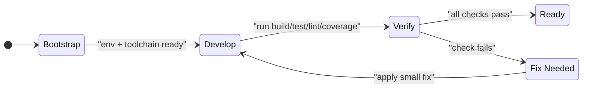
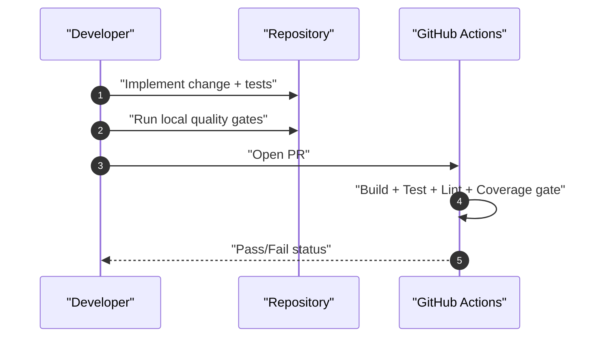

# Local Development and Quality Runbook

Links:
- [Spec index](../spec-index.md)

Spec Namespace: SPEC-RUN
Status: Accepted
Version: 1.0
Owners: Maintainers
Last Updated: 2026-02-09

## Overview

This runbook defines the standard way to develop, test, lint, and verify coverage for the Go Telegram bot project.

## User-visible behavior

- A contributor can bootstrap the project and run quality checks from a clean machine.
- Local checks match CI intent: build, tests, lint, coverage threshold.
- Coverage enforcement fails fast below the project baseline.

## Requirements

- `SPEC-RUN-001`: Project must provide copy/paste local bootstrap and quality commands.
- `SPEC-RUN-002`: Local and CI verification intent must stay aligned.
- `SPEC-RUN-003`: Coverage must be machine-checked with minimum threshold `90`.
- `SPEC-RUN-004`: Docs must describe repository-specific Go development workflow.

## Inputs / Outputs

Inputs:
- Go `1.20+`
- `.env` file based on `.env.example`
- Optional Task CLI

Outputs:
- Built binary (`opencode-bot`)
- Passing unit tests and lint checks
- Coverage profile (`coverage.out`) and threshold validation result

## First 15 Minutes

1. Verify toolchain: `go version` (must be 1.20+).
2. Copy environment file: `cp .env.example .env`.
3. Fill `.env` values (`TELEGRAM_BOT_TOKEN`, `OPENCODE_BASE_URL`, allowed/admin IDs).
4. Run tests: `go test ./...`.
5. Install linter once: `go install github.com/golangci/golangci-lint/cmd/golangci-lint@v1.64.8`.
6. Run lint: `"$(go env GOPATH)/bin/golangci-lint" run --config .golangci.yml ./...`.
7. Run coverage gate: `go test -covermode=count -coverprofile=coverage.out ./internal/... ./pkg/... && go run ./cmd/coveragecheck -file coverage.out -min 90`.
8. Start bot: `go run ./cmd/opencode-bot`.

If you use Task, run equivalent shortcuts:
- `task dev`, `task test`, `task lint`, `task coverage:check`, `task ci`.

## How to Program in This Project (Go)

- Keep orchestration in `cmd/opencode-bot/main.go` and business behavior in `internal/bot`.
- Keep state mapping logic in `pkg/store` and access it through `store.Store`.
- Add behavior with test-first flow:
  1) Add/adjust unit test in `internal/bot/*_test.go` or `pkg/store/*_test.go`.
  2) Implement minimal code change.
  3) Run `go test ./...` and lint/coverage checks.
- Prefer deterministic tests:
  - Mock Telegram and Opencode interfaces.
  - Avoid long sleeps; use bounded channels/timeouts.
- Keep changes small and focused on one behavior slice.

## Quality Commands

Direct commands (no Task required):

```bash
go build -v ./...
go test -v ./...
"$(go env GOPATH)/bin/golangci-lint" run --config .golangci.yml ./...
go test -covermode=count -coverprofile=coverage.out ./internal/... ./pkg/...
go run ./cmd/coveragecheck -file coverage.out -min 90
```

Task equivalents:

```bash
task ci
```

## Troubleshooting

- `TELEGRAM_BOT_TOKEN is required`
  - Set token in `.env`.
- `telegram bot init error`
  - Verify token validity and outbound network access.
- `golangci-lint: command not found`
  - Install with `go install ...@v1.64.8` or use `task lint` fallback.
- `coveragecheck: threshold not met`
  - Add tests for uncovered branches in `internal/bot` first.

## Diagrams (Mermaid)

### State machine (required)



### Sequence diagram (recommended)



## Acceptance Criteria (BDD-ready)

- AC-1 (`SPEC-RUN-001`): A contributor can execute setup and local quality checks using documented commands only.
- AC-2 (`SPEC-RUN-002`): Local quality checks and CI quality checks use equivalent validation intent (build, test, lint, coverage gate).
- AC-3 (`SPEC-RUN-003`): Coverage gate fails when total coverage for `internal/...` + `pkg/...` drops below `90`.
- AC-4 (`SPEC-RUN-004`): Documentation includes project-specific Go development workflow and test-first change process.

## Scenario Placeholders

- SC-1 (AC-1): Fresh machine follows runbook and reaches passing checks.
- SC-2 (AC-2): CI and local command intent remain aligned.
- SC-3 (AC-3): Coverage below threshold returns non-zero status.
- SC-4 (AC-4): New handler change is delivered with test-first workflow.
