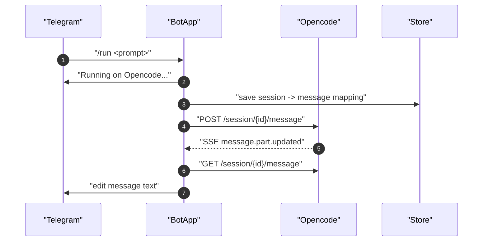
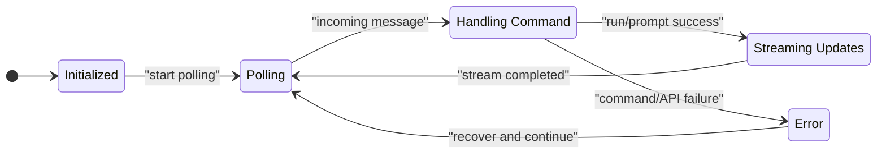

# System Architecture

Links:
- [Spec index](../spec-index.md)
- [Telegram Command Specification](../features/telegram-commands.md)

## Components

- `cmd/opencode-bot/main.go`: bootstrap config, clients, polling/event loops
- `internal/bot/telegram.go`: command routing and handlers
- `internal/bot/opencode_client.go`: HTTP + SSE interaction with Opencode
- `internal/bot/events.go`: event handling and Telegram message edits
- `pkg/store`: in-memory mapping for sessions/messages/users

## Runtime Flow

## State Model

